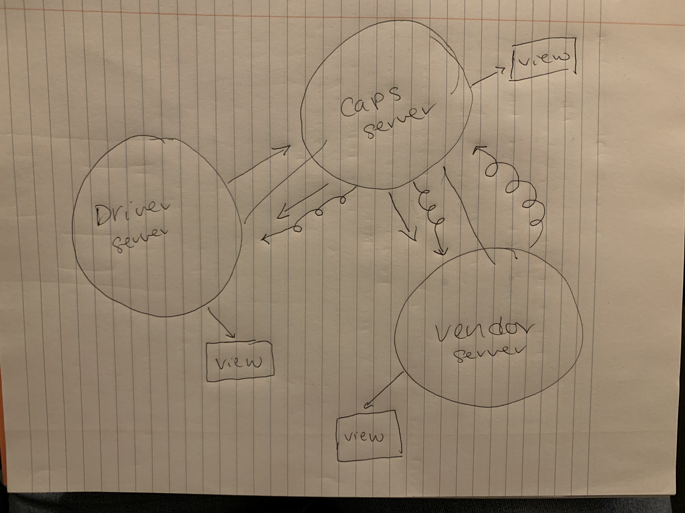

# CAPS - Code Academy Parcel Service (CAPS)
## Author: Sara Russert
## Description of Project
A real-time service that allows for vendors, such as flower shops or restaurants, to alert a system of a package needing to be delivered, for drivers to instantly see what’s in their pickup queue, and then to alert the vendors as to the state of the deliveries (in transit, and then delivered).
## Installing CAPS
git clone https://github.com/401-advanced-javascript-sararussert/caps.git
and npm install
## Using CAPS
To use auth server, follow these steps:
- npm start
- npm test
## Acknowledgments 
Working with Michael, Spencer, and Kevin in Remo
## UML
